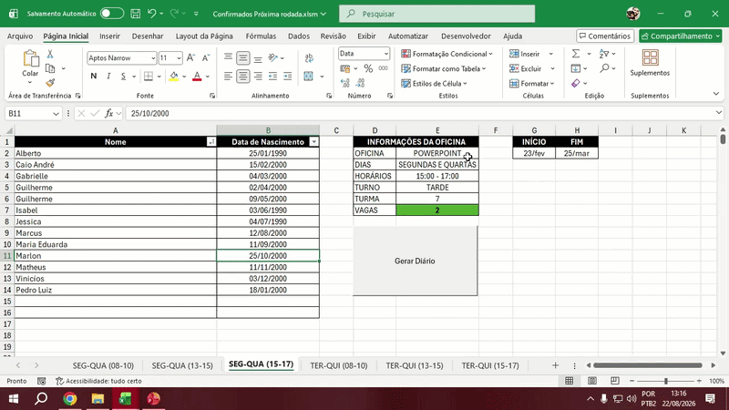
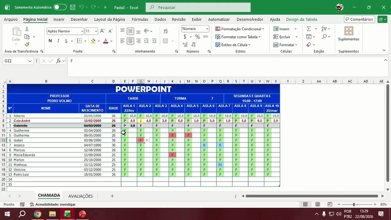
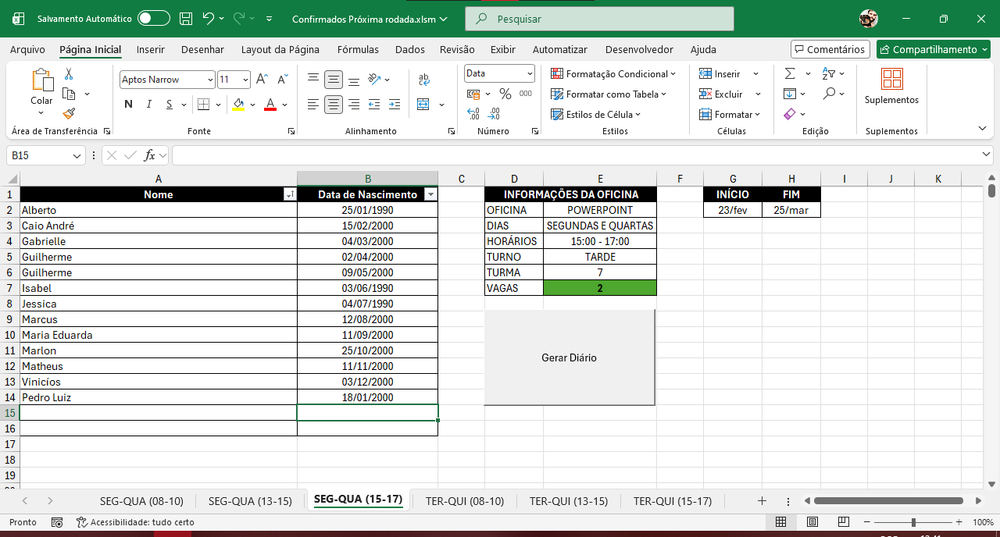
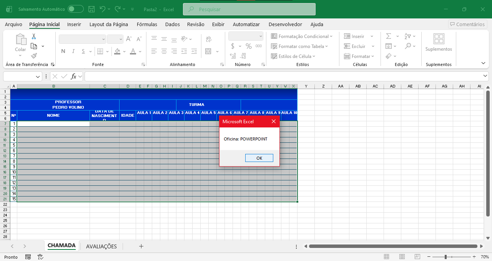
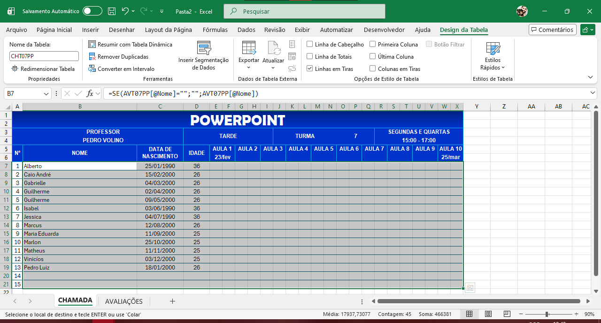
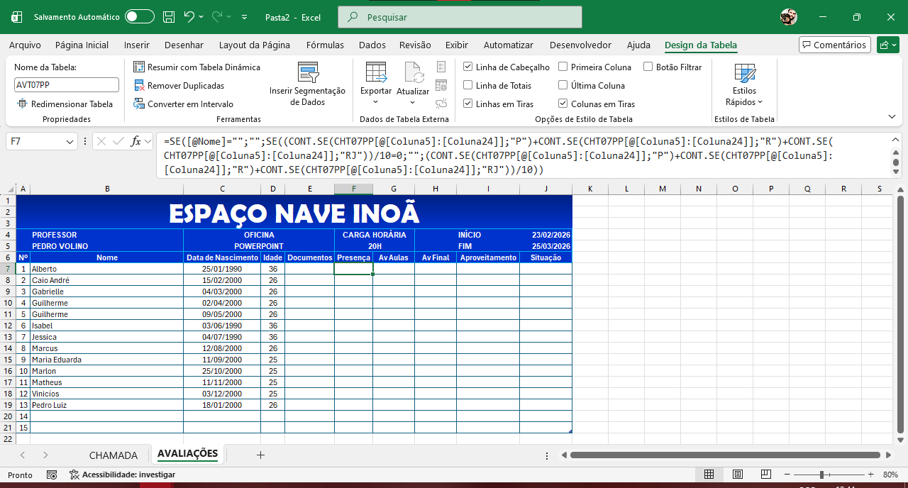

# Gerador Automatizado de Diários de Classe (VBA & Excel) 

Este repositório apresenta uma solução de automação corporativa desenvolvida em Excel e VBA para otimizar, padronizar e blindar contra erros o processo de criação de diários de classe (frequência e avaliações) para oficinas de capacitação profissional.
A ferramenta foi projetada para substituir um processo manual altamente repetitivo e sujeito a falhas de digitação por um fluxo de trabalho seguro de um único clique, gerando diários de classe perfeitamente formatados com fórmulas automáticas e validação dinâmica de dados.

## Cenário 

No ambiente operacional das oficinas, a equipe gerenciava 6 turmas distintas distribuídas por dias e horários específicos ao longo da semana:
*   `SEG-QUA(08-10)` | `SEG-QUA(13-15)` | `SEG-QUA(15-17)`
*   `TER-QUI(08-10)` | `TER-QUI(13-15)` | `TER-QUI(15-17)`

**O problema:** 
1. **Erros de preenchimento:** A transferência manual de nomes de alunos, datas de nascimento e metadados das turmas para os diários causava inconsistências de dados e erros frequentes.
2. **Desperdício de tempo:** Formatar manualmente o layout da folha de presença (Chamada) e da folha de notas (Avaliações) para cada nova turma consumia horas produtivas de trabalho.
3. **Falta de padronização:** Fórmulas de cálculo de frequência e aproveitamento eram muitas vezes inseridas incorretamente, comprometendo os relatórios consolidados finais.

## A Solução

A solução consiste em uma pasta de trabalho matriz (`confirmados-proxima-rodada.xlsm`) que centraliza as 6 listagens de participantes. Através de um botão de automação acionado por macro VBA, o sistema executa o seguinte fluxo:

1. **Leitura Inteligente de Contexto:** Identifica qual planilha de horário está ativa no momento do clique.
2. **Geração Limpa de Documento:** Abre uma nova pasta de trabalho do Excel em branco (`Workbooks.Add`) de forma dinâmica, mantendo a matriz segura e intacta.
3. **Criação de Interface de Confirmação:** Através de instruções interativas programadas dentro do código, o sistema exibe caixas de diálogo modais (`MsgBox`) para que o operador valide em tempo real os dados da oficina (Oficina, Turno, Turma, Horários e datas de início/fim) antes da geração física do diário, permitindo abortar o processo imediatamente caso identifique divergências.
4. **Estruturação do Layout Padrão:** Desenha programaticamente o cabeçalho corporativo, define as larguras das colunas, fontes, cores institucionais (esquema azul escuro) e aplica as bordas das tabelas.
5. **Carga e Processamento de Dados:** Transpõe os dados de identificação dos alunos (Nomes e Datas de Nascimento) contidos no intervalo `A2:B16` diretamente para a nova estrutura.
6. **Injeção de Fórmulas Avançadas:** Insere de forma automatizada fórmulas dinâmicas do Excel com referências estruturadas para calcular automaticamente a idade, a taxa de presença proporcional e a situação final do aluno.

## Demonstração Visual & Gravações:
---
### Demonstrações em Funcionamento

#### A. Processo Completo de Geração Automatizada
Veja abaixo o acionamento do botão, o prompt de validação visual gerado em tempo real e a construção instantânea de um novo arquivo formatado:


#### B. Funcionalidades do Diário Gerado
Após a criação, o diário está pronto para uso, contendo regras de proteção, redimensionamento automático e preenchimento fluido:


### Capturas de Tela Detalhadas

#### 1. Painel de Controle e Matriz de Dados (`tela-inicial.png`)
Esta é a interface de entrada onde os dados dos alunos confirmados são alocados por horário. O botão **\"Gerar Diário\"** centraliza o acionamento da automação VBA.


#### 2. Caixa de Diálogo de Confirmação em Tela (`confirmacao-dados.png`)
Janela modal disparada diretamente pela macro para forçar a validação visual dos metadados da turma pelo usuário antes de gravar fisicamente o novo arquivo no sistema.


#### 3. Diário de Presença Gerado (`planilha-chamada.png`)
O diário de classe final criado programaticamente, contendo o cabeçalho formatado com as informações consolidadas da turma e os campos prontos para o controle de presença de Aula 1 a Aula 10.


#### 4. Folha de Avaliações com Fórmulas Estruturadas (`planilha-avaliacoes.png`)
A aba secundária gerada injeta fórmulas lógicas complexas que calculam o aproveitamento do aluno em tempo real, utilizando referências estruturadas avançadas do Excel.


*(Exemplo da fórmula inteligente injetada dinamicamente via VBA para calcular proporcionalidade de presença):*
```excel
=SE([@Nome]="";"";SE((CONT.SE(CHT07PP[[@Coluna5]:[Coluna24]];"P")+CONT.SE(CHT07PP[[@Coluna5]:[Coluna24]];"P")+CONT.SE(CHT07PP[[@Coluna5]:[Coluna24]];"RJ"))/10=0;"";(CONT.SE(CHT07PP[[@Coluna5]:[Coluna24]];"P")+CONT.SE(CHT07PP[[@Coluna5]:[Coluna24]];"P")+CONT.SE(CHT07PP[[@Coluna5]:[Coluna24]];"RJ"))/10))
```

## Estrutura do Repositório

```text
gerador-diarios/
├── .gitignore               # Ignora arquivos temporários ocultos do Excel (~$*)
├── LICENSE                  # Licença MIT aberta de uso livre
├── README.md                # Esta documentação completa e técnica
├── templates/               # Pasta com a planilha modelo (.xlsm) limpa e anônima
│   └── confirmados-proxima-rodada.xlsm
├── vba-src/                 # Arquivos de código VBA exportados em formato texto
│   └── Modulo1.bas          # Código VBA completo contendo toda a lógica de criação e as MsgBox de confirmação
└── assets/                  # Capturas de tela e GIFs animados para demonstração visual
    ├──01-tela-inicial.png
    ├── 02-confirmacao-dados.png
    ├── 03-planilha-chamada.png
    └── 04-planilha-avaliacoes.png
    └── 05-demonstracao-automacao.gif
    ├── 06-funcionalidades-diario.gif

```

## Como Testar Localmente

1. Faça o clone deste repositório para o seu computador:
   ```bash
   https://github.com/Volino82/gerador-diarios.git
   ```
2. Navegue até a pasta `templates/` e abra o arquivo `confirmados-proxima-rodada.xlsm`.
3. Certifique-se de Habilitar Macros no seu Microsoft Excel quando solicitado na barra de segurança amarela.
4. Selecione uma das abas de horário (ex: `SEG-QUA (15-17)`).
5. Clique no botão cinza **\"Gerar Diário\"**.
6. Acompanhe a mensagem de validação em tela, clique em OK e veja o novo diário ser montado e formatado diante de você de forma 100% automatizada!

## Licença

Este projeto está sob a licença MIT - sinta-se livre para utilizar, modificar e distribuir o código para seus próprios projetos de automação!
